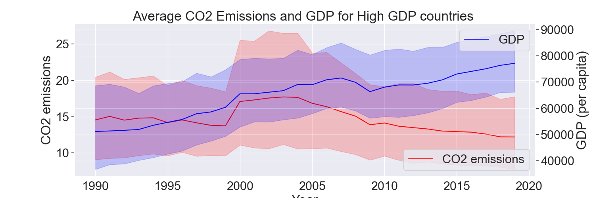
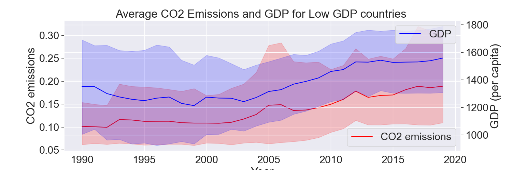
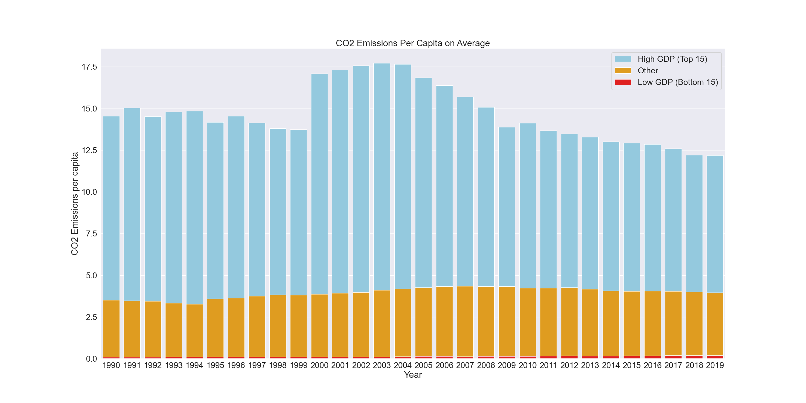

### 1. Over the years, how does the relationship between GDP and CO2 emissions compare for the  15 richest Countries vs the 15 poorest countries? What about during financial crises periods?

To answer this question, I made two line graphs showing the average CO2 emissions and GDP (both per capita), for low GDP countries and high GDP countries. This allowed me to get a better look at if the the relationship between GDP and CO2. You can find more about the process of creating this graph in [Analysis2](notebooks/analysis2.ipynb)

For the 15 countries with the highest GDP, it appears CO2 and GDP both moved together up until around 2005, from then on it seems they diverged since CO2 emissions began decreasing and GDP continued moving upwards. 

For the 15 countries with the lowest GDP, we can see that CO2 emissions and GDP move together very closely. Both are low between 1990 and 1995 and then begin to increase steadily from then on. During the 2008 financial crisis, we see that both CO2 and GDP dipped for high GDP countries. However, for the low GDP countries it appears the 2008 crisis had no impact on their GDP/CO2. Overall presently, CO2/GDP for high GDP countries move oppositely but for low GDP countries they move together

### 2. How does the average CO2 emissions per capita of high GDP countries compare to low GDP countries, and the rest of the world? Has this changed over the years?

This bar graph shows CO2 emissions per capita on average, for high GDP countries (top 15) , low GDP countries (bottom 15), and for the rest of the world. This graph can also be found in [Analysis2](notebooks/analysis2.ipynb). 
From this bar graph we can see that high GDP countries have incredibly high CO2 emissions per capita that range from 17 - 13 tons. Meanwhile, the rest of the world, averages around 3 tons per year and low GDP countries emit less than 1 ton per capita.
High GDP countries seem to have lowered their CO2 emissions in recent years, yet they still have a much higher average of CO2 emissions per capita when compared to the rest of the world and low GDP countries. 
